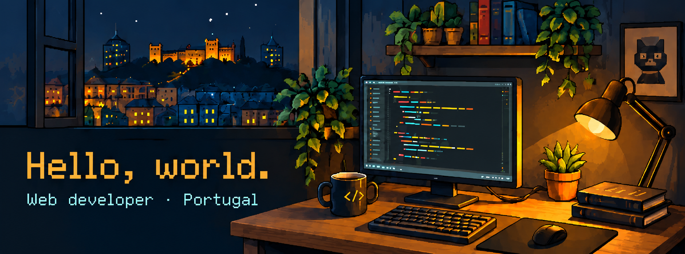

Based in Leiria, Portugal. Working at **VOID Software**.

---

### Frontend

  
  
  
  
  

### Backend

  
  
  

### Styling

  
  
  
  
  

### Testing

  
  
  

---

<!-- Replace YOUR_LINKEDIN_USERNAME with your LinkedIn profile slug. -->

